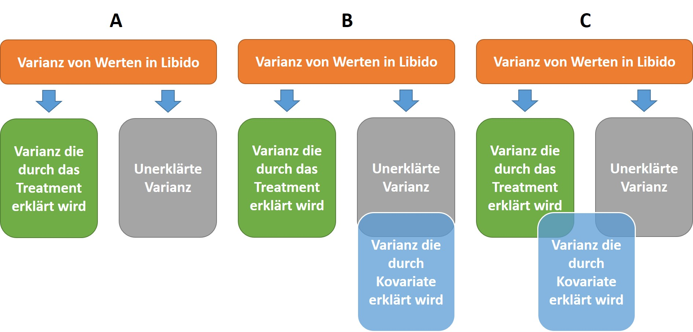
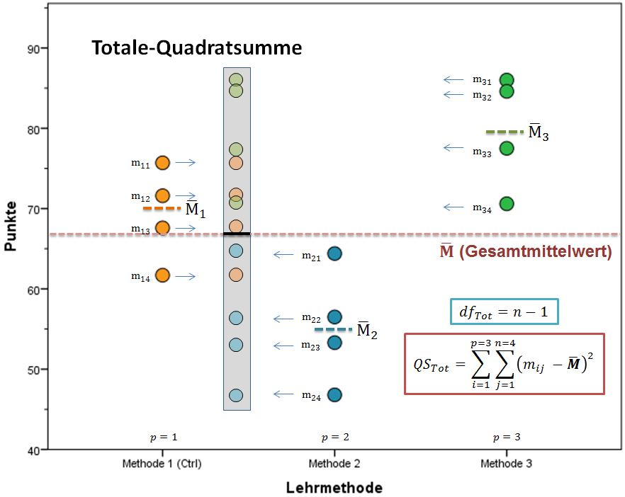
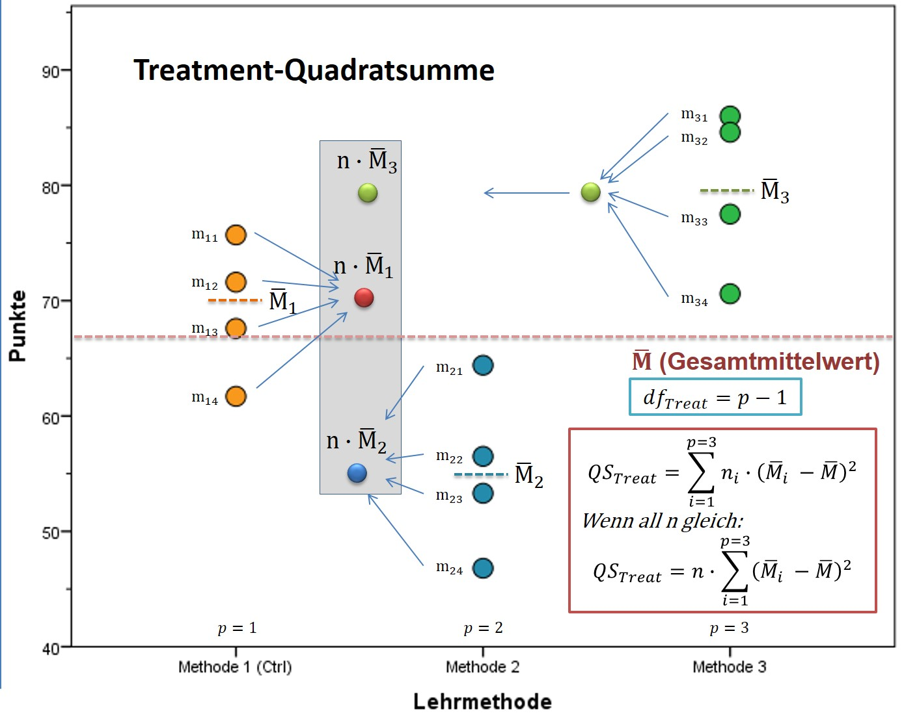
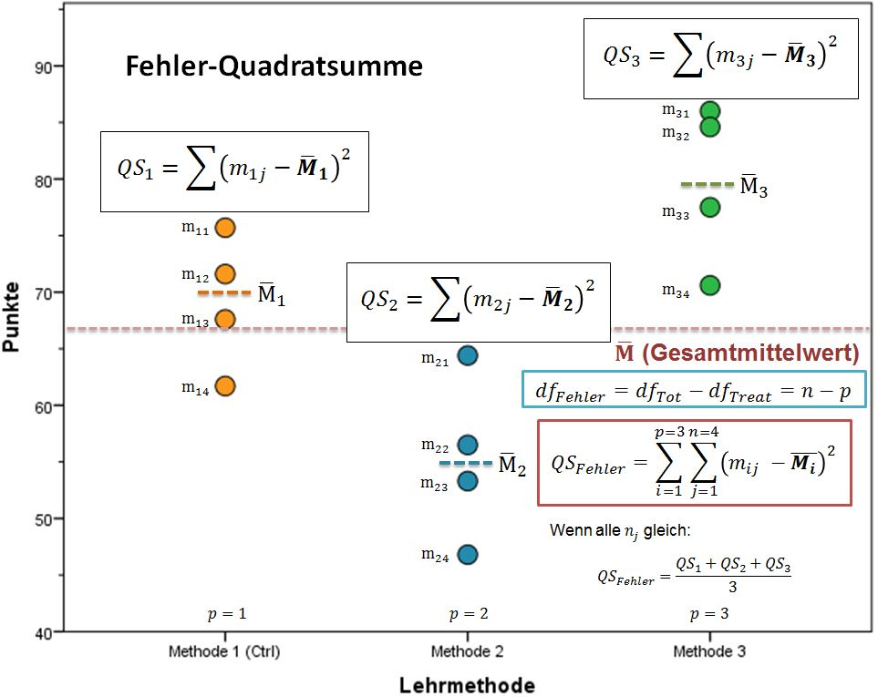
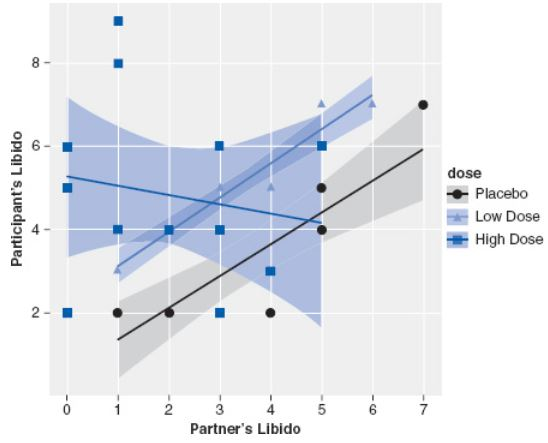

# (PART\*) Teil II: Analysis of Covariance {-}

# Motivation {-}

Die Kovarianzanalyse (ANCOVA) ist ein Spezialfall der ANOVA. Beide werden verwendet, um die Auswirkungen kategorischer Variablen (Faktoren) auf eine intervall- oder ratio-level abhängige Variable zu testen. 

Die ANCOVA gibt uns jedoch die zusätzliche Möglichkeit, gleichzeitig die Wirkung anderer kontinuierlicher Variablen auf die abhängige Variable zu beurteilen oder zu kontrollieren. Kontinuierliche Variablen, die als Unabhängige in einem ANOVA-Design enthalten sind und die mit einer abhängigen Variablen kovariabel sind, nennt man *Kovariablen*.

Bei der ANCOVA geht es im Wesentlichen darum, die Fehlervarianz bei randomisierten Gruppenexperimenten weiter zu verringern.

ANCOVA wird jedoch häufiger eingesetzt, wenn eine Randomisierung nicht möglich ist. In diesen Fällen müssen wir uns oft mit so genannten "nicht-äquivalenten" (nicht zufällig zugeordneten) Gruppen zufrieden geben. Per Definition können sich solche Gruppen in erheblicher Weise unterscheiden, auch bei Merkmalen, die die Ergebnisvariable beeinflussen können. Solange sie nicht berücksichtigt werden, kann das Vorhandensein dieser Hintergrund- oder Fremdvariablen die Fehlervarianz erhöhen, unseren "Signal-Rausch-Abstand" verringern und es letztendlich schwieriger machen, einen echten Unterschied zwischen den Gruppen zu erkennen. 

# Kovarianzanalyse {-}


Im folgenden betrachten wir ein Beispiel, welches die Auswirkungen von Viagra auf den Libido untersucht.

Es ist naheliegend anzunehmen, dass auch andere Faktoren (wie andere Medikamente, Müdigkeit, etc.) den Libido beeinflussen. Wenn diese Variablen (die Kovariablen) gemessen werden, ist es möglich, den Einfluss, den sie auf die abhängige Variable haben, durch Einbeziehung in das Regressionsmodell zu steuern/kontrolliern. 

Ziel ist es, den Effekt der Kovariaten auf die Zielvariable zu *entfernen*. Durch diese Maßnahme sollte sich die Wirkungsweise der unabhängigen Variablen (Viagra) auf den Libodo *besser* zeigen. Es gibt im Wesentlichen zwei Gründe[^5] für die Aufnahme von Kovariablen in die ANOVA:

[^5]: Es gibt noch andere Gründe für die Aufnahme von Kovariablen in die ANOVA, welche in der Berechnung der ANCOVA detailliert beschrieben werden. Siehe [@Stevens], [@Wildt].

* **Reduzierung der Fehlervarianz**: in der ANOVA und beim t-Tests wird die Wirkung eines Experiments anhand der erklärbaren Variabilität in den Daten, mit der nicht erklärbaren Variabiliät verglichen. Wenn ein Teil dieser *unerklärten* Varianz (*SSR*) einer anderen Variablen (*Kovariablen*) zugeordnet werden kann, reduziert sich die Fehlervarianz. Damit kann die Wirkung der unabhängigen Variable (*SSM*) genauer beurteilt werden.

* **Eliminierung von Confounds**: in jedem Experiment kann/wird es Variablen geben, welche nicht gemessen/erhoben wurden, die aber die Ergebnisse der Zielvariablen durchaus beeinflussen können. Sind diese bekannt, kann mit Hilfe der ANCOVA dieser Einfluss beseitigt werden.

Im vorliegenden Beispiel gehen wir davon aus, dass der Libido der Sexualpartner den eigenen Libido beeinflusst[^6]. Das entsprechende Regressionsmodell erweitert sich demnach zu:

[^6]: wie oft sie versuchten, sexuellen Kontakt aufzunehmen.

<center>

$libido_i = b_0 + b_3 \cdot covariate_i + b_2 \cdot high_i + b_1 \cdot low_i + \varepsilon_i$

</center>

## Voraussetzungen {-}

Die ANCOVA hat die gleichen Annahmen wie ANOVA, zu welchen es jedoch noch zwei wichtige zusätzliche Überlegungen gibt:

1. **Unabhängigkeit von der Kovariablen- und dem Treatmenteffekt**.
   Abbildung **4-A** zeigt die bereits aus der ANOVA bekannte Zerlegung der Varianzen in eine Fehlervarianz und einer Treatmentvarianz. Abbildung **4-B** stellt eine ideale Voraussetzung für die Verwendung einer Kovariaten dar. Hierbei wird durch die Kovariate ein Teil der Fehlervarianz erklärt, ohne den Effekt des Treatment zu beeinflussen. Abbildung **4-C** hingegen zeigt das Problem bei einer fälschlicherweise verwendeten Kovariaten. Die Kovariate verringert zwar nach wir vor die Fehlervarianz, aber gleichzeitig wird auch der Treatmenteffekt beeinflusst. Statistisch gesehen können wir nur festhalten, dass die Kovariate und das Treatment Varianz gemeinsam erkären. Eine Trennung dieser gemeinsamen Varianz in Anteile Viagra und Kovariate ist nicht möglich!
   Eine einfache Möglichkeit die Kovariate auf ihre Eigenschaft zu prüfen, ist ein einfacher Mittelwertsvergleich (t-Test, ANOVA) der nach Viagragruppen aufgeteilten Kovariaten. Wenn die Gruppen sich nicht unterscheiden, kann von einer Unabhängigkeit ausgegangen werden und sofern die anderen Voraussetzungen erfüllt sind, die Kovariate verwendet werden. Auch durch eine Randomisierung der Gruppenzuordnung kann man unerwünschte Effekte (in Bezug auf die Wirkung der Kovariaten) zwischen den Gruppen evtl. vermeiden.

<center>

{ width=80% }

</center>

Zum besseren Verständnis der mit den ANOVA-Verfahren verbundenen Varianzaufteilung betrachten wir nochmals im Detail die Eigenschaften der verschiedenen Varianzanteile.

Die Gesamtvarianz (im vorigen Graphen die Varianz von Werten im Libido) wird folgendermaßen ermittelt:

<center>

{ width=80% }

</center>


Die Treatmentvarianz (im vorigen Graphen die Varianz die durch das Treatment erklärt wird) entspricht der Variabilität der Mittelwerte der jeweiligen Gruppen (in unserem Fall der Dosierungsstufen):

<center>

{ width=80% }

</center>

Die Fehlervarianz wird aus den durchschnittlichen Abweichungen der beobachteten Werte zu den jeweiligen Gruppenmittelwerten bestimmt (geschätzt). Anhand dieser Darstellung wird auch klar, warum die Varianzgleichheit über die Gruppen hinweg gleich sein sollte. Wäre das nämlich nicht gegeben, würde die Additivität ($QS_1 + \cdots + QS_k$ nicht gegeben sein.

<center>

{ width=80% }

</center>


2. **Homogenität der Regressionssteigungen**.
   Bei einer ANCOVA wird die Gesamtbeziehung zwischen dem Ergebnis (abhängige Variable) und der Kovariablen analysiert. D.h., es wird eine *Regressionslinie an den gesamten Datensatz angepasst* und man *ignoriert, zu welcher Gruppe eine Person gehört*. Bei der Anpassung dieses Gesamtmodells gehen wir daher davon aus, dass diese Gesamtbeziehung für alle Teilnehmergruppen gilt. Diese Annahme ist für die ANCOVA sehr wichtig. Der beste Weg diese Annahme zu kontrollieren, ist eine Darstellung der Kovariablen (*Partner's Libido*) auf der einen und dem Ergebnis (*Libido*) auf der anderen Achse, getrennt nach den Gruppen (*Dosierung*). Die Regressionslinien sollten dann mehr oder weniger gleich aussehen (d.h. die Werte von $b$ in jeder Gruppe sollten gleich sein). Im nachfolgender Darstellung wäre diese Voraussetung nicht erfüllt!

<center>

{ width=60% }

</center>

## Berechnung einer ANCOVA {-}

Bei der Berechnung einer ANCOVA sollten folgende Schritte durchgeführt werden:

1. Grafischen Darstellung der Daten und der Berechnung einiger deskriptiver Statistiken. Dabei sollten auch die Verteilungsannahmen überprüfen und den Levene-Test durchgeführt werden (Homogenitätstest).
2. Überprüfen der Kovariable und alle unabhängigen Variablen auf Unabhängigkeit, d.h. eine ANOVA mit der Kovariablen als Ergebnis und alle unabhängigen Variablen als Prädiktoren durchführen. Damit wird sichergestellt, dass sich die Kovariable auf den Ebenen dieser Variablen nicht signifikant unterscheidet. Wenn man ein signifikantes Ergebnis erhält, dann ist die Analyse bei diesem Schritt beendet[^7].
3. Durchführen der ANCOVA.
4. Berechnung der *Kontraste* oder *post hoc-Tests* (falls signifikante Ergebnisse vorliegen).
5. Überprüfen der Homogenität der Regressionssteigungen. Dies kann graphisch (siehe oben) durchgeführt werden, oder man kann auch die ANCOVA erneut ausführen und die Interaktion zwischen der unabhängigen Variable und der Kovariablen ins Modell aufnehmen. Wenn diese Interaktion signifikant ist, kann man nicht von einer Homogenität der Regressionsflanken ausgehen!

[^7]: möglicherweise kann man eine robuste Version des Tests ausführen, Details später.

### Deskriptive, graphisch und Homogenität {-}

Um die Verteilung von Daten darzustellen, kann man z.B. Boxplots für *Libido* als auch für *Libido des Partners* erzeugen. Darüber hinaus ist es hilfreich, die Beziehung zwischen der Ergebnisvariablen und der Kovariablen innerhalb jeder Gruppe zu betrachten (dies sagt uns etwas über die Homogenität der Steigungen aus).


```r
  options(digits = 3)
  
  viagraData       <- read.delim("C:/NextCloud/DATEN/CSV_Text/ViagraCovariate.dat", header = TRUE)
  viagraData$dose  <- factor(viagraData$dose, levels = c(1:3), labels = c("Placebo", "Low Dose", "High Dose"))
  
  restructuredData <- melt(viagraData,
                           id = c("dose"),
                           measured = c("libido", "partnerLibido")) 
  names(restructuredData) <- c("dose", "libido_type", "libido")
  
  boxplot <- ggplot(restructuredData, aes(dose, libido)) +
             geom_boxplot() + 
             facet_wrap(~libido_type) + 
             labs(x = "Dose", y = "Libido") +
             theme_bw()
  boxplot
```


Die Boxplots zeigen den Libido bei den Teilnehmern und ihren Partnern über die drei Dosen von Viagra. Die Libido scheint für die Teilnehmer mit zunehmender Dosis von Viagra zu steigen, aber das Gegenteil gilt für ihre Partner.

Neben der graphischen Darstellung sind auch die deskriptiven Werte aufschlussreich, da diese Kennwerte wie die Streung ($sd$) und Mittelwerte ($\bar{x}$), Konfidenzintervalle ($CI$), etc. ausgegeben werden.


```r
  Res1 <- by(viagraData$libido, viagraData$dose, stat.desc, basic = F, simplify = TRUE)
  pander(Res1$Placebo)
```


----------------------------------------------------------------------
 median   mean    SE.mean   CI.mean.0.95    var    std.dev   coef.var 
-------- ------- --------- -------------- ------- --------- ----------
   2      3.222   0.5958       1.374       3.194    1.787     0.5547  
----------------------------------------------------------------------

```r
  pander(Res1$`Low Dose`)
```


----------------------------------------------------------------------
 median   mean    SE.mean   CI.mean.0.95    var    std.dev   coef.var 
-------- ------- --------- -------------- ------- --------- ----------
  4.5     4.875   0.5154       1.219       2.125    1.458     0.299   
----------------------------------------------------------------------

```r
  pander(Res1$`High Dose`)
```


----------------------------------------------------------------------
 median   mean    SE.mean   CI.mean.0.95    var    std.dev   coef.var 
-------- ------- --------- -------------- ------- --------- ----------
   4      4.846   0.5867       1.278       4.474    2.115     0.4365  
----------------------------------------------------------------------

```r
  # Res1 <- data.frame(unlist(by(viagraData$libido, viagraData$dose, stat.desc, basic = F)))
  # colnames(Res1) <- c("Statistic Libido")
  # pander(Res1)
  
  Res2 <- by(viagraData$partnerLibido, viagraData$dose, stat.desc, basic = F)
  pander(Res2$Placebo)
```


----------------------------------------------------------------------
 median   mean    SE.mean   CI.mean.0.95    var    std.dev   coef.var 
-------- ------- --------- -------------- ------- --------- ----------
   4      3.444   0.6894        1.59       4.278    2.068     0.6005  
----------------------------------------------------------------------

```r
  pander(Res2$`Low Dose`)
```


----------------------------------------------------------------------
 median   mean    SE.mean   CI.mean.0.95    var    std.dev   coef.var 
-------- ------- --------- -------------- ------- --------- ----------
  2.5     3.125   0.6105       1.444       2.982    1.727     0.5526  
----------------------------------------------------------------------

```r
  pander(Res2$`High Dose`)
```


---------------------------------------------------------------------
 median   mean   SE.mean   CI.mean.0.95    var    std.dev   coef.var 
-------- ------ --------- -------------- ------- --------- ----------
   2       2     0.4529       0.9868      2.667    1.633     0.8165  
---------------------------------------------------------------------

```r
  # Res2 <- data.frame(unlist(by(viagraData$partnerLibido, viagraData$dose, stat.desc, basic = F)))
  # colnames(Res2) <- c("Statistic Partners Libido")
  # pander(Res2)
  
  pander(stat.desc(viagraData$libido, basic = F))
```


----------------------------------------------------------------------
 median   mean    SE.mean   CI.mean.0.95    var    std.dev   coef.var 
-------- ------- --------- -------------- ------- --------- ----------
   4      4.367   0.3571       0.7304      3.826    1.956     0.448   
----------------------------------------------------------------------

```r
  pander(stat.desc(viagraData$partnerLibido, basic = F))
```


----------------------------------------------------------------------
 median   mean    SE.mean   CI.mean.0.95    var    std.dev   coef.var 
-------- ------- --------- -------------- ------- --------- ----------
  2.5     2.733   0.3388       0.6929      3.444    1.856     0.6789  
----------------------------------------------------------------------

Der Test auf Varianzhomogeniät wird mit dem Levene's-Test durchgeführt. Dabei zeigt sich der Test mit dem Median als zentraler Kennwert robuster als die Schätzung durch den Mittelwert (*Bemerkung*: man kann auch das Verhältnis der größten zur kleinsten Varianz[^8] (aus deskriptiver Statistik) bilden und in einer entsprechenden Tabelle auf Signifikanz prüfen).


```r
  pander(leveneTest(viagraData$libido, viagraData$dose, center = median)) # für robustere Schätzung!
```


-----------------------------------
  &nbsp;     Df   F value   Pr(>F) 
----------- ---- --------- --------
 **group**   2    0.3256    0.7249 

             27     NA        NA   
-----------------------------------

Table: Levene's Test for Homogeneity of Variance (center = median)

```r
  pander(leveneTest(viagraData$libido, viagraData$dose, center = mean))
```


-----------------------------------
  &nbsp;     Df   F value   Pr(>F) 
----------- ---- --------- --------
 **group**   2    0.7112     0.5   

             27     NA        NA   
-----------------------------------

Table: Levene's Test for Homogeneity of Variance (center = mean)

[^8]: Hartely's $F_{max}$ variance ratio.

### Unabhängigkeit {-}

Die Unabhängigkeit kann man relativ einfach durch eine ANOVA mit *partnerLibido* als Ergebnis und *Dosis* als Prädiktor durchführen.


```r
  checkIndependenceModel <- aov(partnerLibido ~ dose, data = viagraData)
  pander(summary(checkIndependenceModel))
```


----------------------------------------------------------
    &nbsp;       Df   Sum Sq   Mean Sq   F value   Pr(>F) 
--------------- ---- -------- --------- --------- --------
   **dose**      2    12.77     6.385     1.979    0.1577 

 **Residuals**   27    87.1     3.226      NA        NA   
----------------------------------------------------------

Table: Analysis of Variance Model

```r
  pander(summary.lm(checkIndependenceModel))
```


-----------------------------------------------------------------
      &nbsp;         Estimate   Std. Error   t value   Pr(>|t|)  
------------------- ---------- ------------ --------- -----------
  **(Intercept)**     3.444       0.5987      5.753    4.062e-06 

 **doseLow Dose**    -0.3194      0.8727     -0.366     0.7172   

 **doseHigh Dose**    -1.444      0.7788     -1.855     0.0746   
-----------------------------------------------------------------


--------------------------------------------------------------
 Observations   Residual Std. Error   $R^2$    Adjusted $R^2$ 
-------------- --------------------- -------- ----------------
      30               1.796          0.1279      0.06326     
--------------------------------------------------------------

Table: Fitting linear model: partnerLibido ~ dose

```r
  PD1 <- data.frame(summaryBy(partnerLibido ~ dose, data = viagraData, FUN = mean))

  colnames(PD1) <- c("dose", "PLM")
  ggplot(data = PD1, aes(x = dose, y = PLM, fill = dose)) +
    geom_bar(colour="black", stat="identity") +
    theme_bw()
```


```r
    guides(fill=FALSE)    
```

```
## $fill
## [1] FALSE
## 
## attr(,"class")
## [1] "guides"
```

Bei den Koeffizienten (Estimate) des Modells entspricht der Intercept den Mittelwert der ersten Dosierungsstufe (= Placebo) und die weiteren den jeweiligen Abstand zum Mittelwert der Placebodosierung!

### Berechnung ANCOVA {-}

Nach Überprüfung der Voraussetzungen können wir die ANCOVA berechnen. 


```r
    pander(Anova(aov(libido ~ partnerLibido + dose, data = viagraData), type = "III"))
```


-----------------------------------------------------
      &nbsp;         Sum Sq   Df   F value   Pr(>F)  
------------------- -------- ---- --------- ---------
  **(Intercept)**    12.94    1     4.257    0.0492  

 **partnerLibido**   15.08    1     4.959    0.03483 

     **dose**        25.19    2     4.142    0.02745 

   **Residuals**     79.05    26     NA        NA    
-----------------------------------------------------

Table: Anova Table (Type III tests)

Betrachtet man die Signifikanz-Werte, so ist klar, dass die Kovariable die abhängige Variable signifikant vorhersagt, da $F(1,26) = 4.96, p = .035$ ist. Es ist also davon auszugehen, dass der Libido der Person durch die Libido des Partners beeinflusst wird.

Interessant ist, dass nach Berücksichtigung der Wirkung des Libido's vom Partners die Wirkung von Viagra signifikant ist ($F(2,26) = 4.14, p = .028$).

Wenn wir das nochmals mit den Ergebnissen einer ANOVA (also ohne Berücksichtigung der Kovariaten vergleichen), stellen wir fest, dass durch die Kovariate sich ein nicht signifikantes in ein signifikantes Ergebnis geändert hat.


```r
    pander(Anova(aov(libido ~ dose, data = viagraData), type = "III"))
```


-----------------------------------------------------
     &nbsp;        Sum Sq   Df   F value    Pr(>F)   
----------------- -------- ---- --------- -----------
 **(Intercept)**   93.44    1     26.81    1.891e-05 

    **dose**       16.84    2     2.416     0.1083   

  **Residuals**    94.12    27     NA         NA     
-----------------------------------------------------

Table: Anova Table (Type III tests)

```r
    pander(summary.lm(aov(libido ~ partnerLibido + dose, data = viagraData)))
```


----------------------------------------------------------------
      &nbsp;         Estimate   Std. Error   t value   Pr(>|t|) 
------------------- ---------- ------------ --------- ----------
  **(Intercept)**     1.789       0.8671      2.063     0.0492  

 **partnerLibido**    0.416       0.1868      2.227    0.03483  

 **doseLow Dose**     1.786       0.8494      2.102    0.04535  

 **doseHigh Dose**    2.225       0.8028      2.771    0.01018  
----------------------------------------------------------------


--------------------------------------------------------------
 Observations   Residual Std. Error   $R^2$    Adjusted $R^2$ 
-------------- --------------------- -------- ----------------
      30               1.744          0.2876       0.2055     
--------------------------------------------------------------

Table: Fitting linear model: libido ~ partnerLibido + dose

### Interpretation ANCOVA {-}

Es scheint ziemlich klar zu sein, dass die signifikante ANOVA einen Unterschied zwischen der Placebogruppe und den beiden experimentellen Gruppen widerspiegelt.


-------------------------------------------------------
      &nbsp;         Sum Sq   Df   F value    Pr(>F)   
------------------- -------- ---- --------- -----------
  **(Intercept)**    76.07    1     25.02    3.342e-05 

 **partnerLibido**   15.08    1     4.959     0.03483  

     **dose**        25.19    2     4.142     0.02745  

   **Residuals**     79.05    26     NA         NA     
-------------------------------------------------------

Table: Anova Table (Type III tests)

Dieser Effekt kann damit begründet werden, da niedrig- und hochdosierten Gruppen sehr ähnliche Mittel haben ($\bar{x}_{Low} = 4.88$, $\bar{x}_{High} = 4.85$, während der Mittelwert der Placebogruppe bei $\bar{x}_{Placebo} = 3.22$ viel niedriger ist. 


------------------------------------------------------
    &nbsp;       Libido   Libido_Partner   Libido_Adj 
--------------- -------- ---------------- ------------
  **Placebo**    3.222        3.444          2.926    

 **Low Dose**    4.875        3.125          4.712    

 **High Dose**   4.846          2            5.151    
------------------------------------------------------

Eigentlich können wir aber diese Gruppenmittel nicht interpretieren, da sie nicht um den Effekt der Kovarianz bereinigt wurden. Diese ursprünglichen Mittel sagen uns nichts über die Gruppenunterschiede, die sich in der signifikanten ANCOVA widerspiegeln! Daher müssen für diesen Vergleich die um den Effekt der Kovariaten bereinigten Mittelwerte verwendet werden. Diese sind in obiger Tabelle in Spalte *Libido_Adj* angegeben!

<!-- Um die angepassten Mittel zu erhalten, müssen wir die *effect()* Funktion im Effektpaket verwenden. Dies erzeugt eine zusammenfassende Tabelle von Mitteln für einen bestimmten Effekt in einem Modell, das mit aov() oder lm() erstellt, aber an andere Variablen im Modell angepasst wurde (so genannte marginale Mittel).  -->

### Geplante Kontraste {-}

Für die Berechnung von Kontrasten können entweder vordefinierte Kontrastcodes, oder eigene Kontrastekodierungen angegeben werden[^9]. In R lässt sich z.B. ein Kontrast durch folgende Eingabe definieren:


```r
  # für orthogonale Kontraste nach Helmert
  contrasts(viagraData$dose) <- contr.helmert(3)
  # für Vergleich von Placebo vs. low- und highdose (-2,1,1), sowie low vs. high
  contrasts(viagraData$dose) < -cbind(c(-2,1,1), c(0,-1,1))
```

[^9]: für eine Liste vordefinierter Kontraste siehe Literatur. Kontraste können sowohl in SPSS wie auch in R durch entsprechende Kontrastcodierungen definiert werden. Bei R ist darauf zu achten, dass bei orthogonalen Kontrasten die Type III sum of squares verwendet wird, da sonst die Quatratsummen für derartige Kontraste nicht stimmen!


-----------------------------------------------------------------
      &nbsp;         Estimate   Std. Error   t value   Pr(>|t|)  
------------------- ---------- ------------ --------- -----------
  **(Intercept)**     3.126       0.625       5.002    3.342e-05 

 **partnerLibido**    0.416       0.1868      2.227     0.03483  

     **dose1**        0.6684       0.24       2.785    0.009852  

     **dose2**        0.2196      0.4056     0.5414     0.5928   
-----------------------------------------------------------------

Die Ausgabe des zweiten - oben angegebenen - Kontrastes lässt sich folgendermaßen interpretieren:

* die erste Variable (*Dosis1*) vergleicht die Placebogruppe mit der Niedrig- und Hochdosisgruppe. Als solches vergleicht es den angepassten Mittelwert der Placebogruppe ($\bar{x}_{Placebo} = 2.93$) mit dem Durchschnitt der angepassten Mittelwerte für die niedrig- und hochdosierten Gruppen ($(4.71+5.15)/2 = 4.93$). 
* der b-Wert für die erste Variable sollte daher die Differenz zwischen diesen Werten sein: $4.93 - 2.93 = 2$.
* dieser Wert wird durch die Anzahl der Gruppen innerhalb des Kontrastes (d.h. 3) dividiert und somit $2/3 = .67$ (wie in der Ausgabe) beträgt. Die zugehörige $t$-Statistik ist signifikant, was darauf hindeutet, dass sich die Placebogruppe signifikant vom kombinierten Mittelwert der Viagra-Gruppen unterschied.
* die zweite Variable (*Dosis2*) vergleicht die niedrig- und hochdosierten Gruppen, so dass der $b$-Wert die Differenz zwischen den eingestellten Mitteln dieser Gruppen sein sollte: $5.15 - 4.71 = 0.44$. Dieser Wert wird durch die Anzahl der Gruppen innerhalb des Kontrastes (d.h. 2) dividiert wird und somit $0,44/2 = 0,22$ (wie in der Ausgabe) beträgt. 
* die zugehörige $t$-Statistik ist nicht signifikant ($p = .590$), was darauf hindeutet, dass die hochdosierte Gruppe keine signifikant höhere Libido produzierte als die niedrigdosierte Gruppe.
* der Wert für die *Kovariable* beträgt ($b = 0.416$). Wenn also der Libido eines Partners um eine Einheit zunimmt, sollte der Libido der Person um knapp eine halbe Einheit zunehmen (obwohl es nichts gibt, was auf einen kausalen Zusammenhang zwischen den beiden hinweist). 
* das Vorzeichen dieses Koeffizienten zeigt in welche Richtung die Beziehung zwischen der Kovariablen und dem Ergebnis geht. Da der Koeffizient in diesem Beispiel positiv ist, bedeutet dies also, dass die Libido des Partners in einem positiven Verhältnis zur Libido des Teilnehmers steht: 

* mit dem einen steigt auch der andere. 
* ein negativer Koeffizient würde das Gegenteil bedeuten: wenn einer steigt, sinkt der andere.

### Interpretation Kovariate {-}

Für die Interpretatiom der Kovariaten verwendet man am besten die Parameterschätzungen ($b$) in folgender Weise:

* wenn der $b$-Wert für die Kovariable positiv ist, haben die Kovariable und die Ergebnisvariable eine positive Beziehun, also mit zunehmenden Werten der Kovariable steigt auch das Ergebnis!
* wenn der $b$-Wert negativ ist, bedeutet das das Gegenteil. 

Für diese Daten war der $b$-Wert positiv, was darauf hindeutet, dass mit zunehmender Libido des Partners auch die Libido des Teilnehmers steigt. Eine weitere Möglichkeit, das Gleiche zu entdecken, besteht darin, einfach einen Streudiagramm der Kovariablen gegen das Ergebnis zu zeichnen.

Abschließend wird durch den Scatterplot nochmals bestätigt, was wir bereits wissen: die Kovariable bewirkt, dass mit zunehmender Partnerlibido auch die Libido des Teilnehmers zunimmt (wie die Steigung der Regressionslinie zeigt).


```r
    scatter <- ggplot(viagraData, aes(partnerLibido, libido)) +
      geom_point(size = 3) + 
      geom_smooth(method = "lm", alpha = 0.4) + 
      labs(x = "Partner's Libido", y = "Participant's Libido") +
      theme_bw()
    scatter
```


### Post hoc Tests {-}

Wie bereits aus der ANOVA bekannt sein sollte, werden bei den Post hoc Tests alle Stufen der unabhängigen Variablen paarweise miteinander verglichen. Im Unterschied zur herkömmlichen ANOVA weden jedoch bei der ANCOVA die adjustierten Mittelwerte verwendet!

Das Ergebnis zeigt die drei Vergleiche (niedrige Dosis vs. Placebo, hohe Dosis vs. Placebo, hohe Dosis vs. niedrige Dosis). 


```r
    postHocs <- glht(viagraModel, linfct = mcp(dose = "Tukey"))
    PostHocRes <- summary(postHocs)
```

Verglichen werden die Differenzen zu den adjustierten Gruppenmitteln 

* die Schätzung für die niedrige Dosis vs. Placebo beträgt $4.71 - 2.93 = 1.78$
* für die hohe Dosis vs. Placebo beträgt sie $5.15 - 2.93 = 2.22$ und 
* für die niedrige vs. hohe $5.15 - 4.71 = 0.44$

Der angegebene Standardfehler bezieht sich auf die Differenz zwischen den adjusiterten Mittelwerten.

Der $t$-Test (Differenz zwischen den Mitteln geteilt durch den Standardfehler) und dem zugehörigen $p$-Wert deutet auf signifikante Unterschiede zwischen der Hochdosis- und Placebogruppe ($t = 2.77, p < .050$) hin.

Kein Unterschied besteht zwischen der Niedrigdosisgruppe und der Placebogruppe ($t = 2.10, p = .120$) und der Hochdosisgruppe ($t = 0.54, p = .850$). 

Die Konfidenzintervalle bestätigen diese Schlussfolgerung (weil sie für den Vergleich der Hochdosis- und Placebogruppen Null nicht enthalten). 


```r
    PostHocRes
```

```
## 
## 	 Simultaneous Tests for General Linear Hypotheses
## 
## Multiple Comparisons of Means: Tukey Contrasts
## 
## 
## Fit: aov(formula = libido ~ partnerLibido + dose, data = viagraData)
## 
## Linear Hypotheses:
##                           Estimate Std. Error t value Pr(>|t|)  
## Low Dose - Placebo == 0      1.786      0.849    2.10    0.109  
## High Dose - Placebo == 0     2.225      0.803    2.77    0.026 *
## High Dose - Low Dose == 0    0.439      0.811    0.54    0.852  
## ---
## Signif. codes:  0 '***' 0.001 '**' 0.01 '*' 0.05 '.' 0.1 ' ' 1
## (Adjusted p values reported -- single-step method)
```

```r
    confint(postHocs)  
```

```
## 
## 	 Simultaneous Confidence Intervals
## 
## Multiple Comparisons of Means: Tukey Contrasts
## 
## 
## Fit: aov(formula = libido ~ partnerLibido + dose, data = viagraData)
## 
## Quantile = 2.48
## 95% family-wise confidence level
##  
## 
## Linear Hypotheses:
##                           Estimate lwr    upr   
## Low Dose - Placebo == 0    1.786   -0.325  3.896
## High Dose - Placebo == 0   2.225    0.230  4.220
## High Dose - Low Dose == 0  0.439   -1.576  2.455
```

## Nützliche Graphen {-}

Zur Überprüfung von Voraussetzungen können sich folgende Graphiken als hilfreich erweisen:


```r
    plot(viagraModel)
```


Von den vier Diagramme sind die ersten beiden die wichtigsten: 

* Ersterer kann zur Überprüfung der Varianzhomogenität der Varianz verwendet werden. Es zeigt sich,  dass die Verteilung der Scores an einigen Stellen breiter als an anderenis (Funnelling). Die Residuen sind also heteroscedastisch. 
* Das zweite Diagramm ist ein Q-Q-Diagramm. Die Punkte im Diagramm sollten nahe der diagonalen Linie liegen. Die vorliegende Verteilung deutet darauf hin, dass keine Normalverteilung vorliegt und daher eher eine robuste ANCOVA[^10] angebracht wäre.
* Die dritte Graphik wird auch als *Spread-Location-Plot* bezeichnet. Diese Darstellung zeigt, ob die Residuen gleichmäßig über die Bereiche der Prädiktoren verteilt sind. So können Sie die Annahme der gleichen Varianz (Homoscedastizität) überprüfen. Es ist gut, wenn man eine horizontale Linie mit gleichmäßig (zufällig) gespreizten Punkten sehen - was hier nicht der Fall ist.
* Die vierte Graphik identifiziert einflussreiche Fälle (Ausreißer). Nicht alle Ausreißer beeinflussen die linearen Regressionsanalyse im negativen Sinn, d.h. die Ergebnisse wären nicht viel anders, wenn wir sie entweder einbeziehen oder von der Analyse ausschließen würden. Sie folgen in den meisten Fällen dem Trend und sind nicht wirklich wichtig. Andererseits können einige Fälle sehr einflussreich sein, auch wenn sie sich in einem angemessenen Bereich der Werte bewegen. Sie können Extremfälle gegen eine Regressionslinie sein und die Ergebnisse verändern, wenn wir sie von der Analyse ausschließen. Im Gegensatz zu den anderen Graphiken sind hier Muster nicht relevant. Man achtet auf die äußeren Werte in der oberen rechten Ecke oder in der unteren rechten Ecke. Diese Punkte sind die Orte, an die für eine Regressionslinie einflussreich sein können. Man beachtet vor allem Fälle, die *außerhalb einer gestrichelten Linie* (Cook's Distance) sind. Werte die außerhalb liegen, sind für die Regressionsergebnisse von Bedeutung. Die Regressionsergebnisse werden geändert, wenn wir diese Fälle ausschließen!

[^10]: robuste ANCOVAS werden in dieser LV nicht näher besprochen - siehe Literatur.

## Homogenität der Steigung {-}

Bereits im Scatterplot der nach Gruppen getrennten Regressionen konnten wir feststellen, dass die Annahme der Homogenität der Regressionssteigungen für die *Hochdosisgruppe* unterschiedlich verletzt wird. Um einen statistischen Test dieser Annahme durchzufürhen, wird die ANCOVA unter Einbeziehung des Interaktionseffektes zwischen der Kovariaten und dem Prädiktor nochmals durchgeführt.


```r
    hoRS <- aov(libido ~ partnerLibido + dose + dose:partnerLibido, data = viagraData)
    # Ident mit obiger Zeile!
    # hoRS <- aov(libido ~ partnerLibido*dose, data = viagraData)
    hoRS_Res <- Anova(hoRS, type="III")
    pander(hoRS_Res)
```


------------------------------------------------------------
         &nbsp;           Sum Sq   Df   F value    Pr(>F)   
------------------------ -------- ---- --------- -----------
    **(Intercept)**       53.54    1     21.92    9.323e-05 

   **partnerLibido**      17.18    1     7.035     0.01395  

        **dose**          36.56    2     7.484     0.00298  

 **partnerLibido:dose**   20.43    2     4.181     0.02767  

     **Residuals**        58.62    24     NA         NA     
------------------------------------------------------------

Table: Anova Table (Type III tests)

Die Auswirkungen der Dosis von Viagra und der Libido des Partners sind immer noch signifikant, aber da die  Interaktion (partnerLibido:dose) signifikant ($p = .028$) ist, ist die Annahme der Homogenität der Regressionsgeraden verletzt. 

Obwohl dieser Befund nicht überraschend ist (vgl. Graphik oben), gibt er Anlass zur Sorge über die Hauptanalyse. Dieses Beispiel veranschaulicht, warum es wichtig ist, Annahmen zu testen und nicht nur die Ergebnisse einer Analyse blind zu akzeptieren!

## Bericht der Ergebnisse {-}

Der Ergebnissbericht einer ANCOVA ist weitgehend identisch mit der einer ANOVA. Hinzu kommt lediglich die Wirkung der Kovariablen. Für die Kovariable und den experimentellen Effekt berichten wir Details über das $F$-Verhältnis und die Freiheitsgrade, aus denen es berechnet wurde. In beiden Fällen wurde das $F$-Verhältnis aus der Division der mittleren Quadrate für den Effekt durch die mittleren Quadrate der Residuen ermittelt. Die Freiheitsgrade zur Beurteilung des $F$-Wertes sind daher die Freiheitsgrade für die Wirkung des Modells ($df_M = 1$ für die Kovariable und $2$ für die experimentelle Wirkung) und die Freiheitsgrade für die Residuen des Modells ($df_R = 26$ für die Kovariable und die experimentelle Wirkung). Der Bericht könnte folgendermaßen abgefasst werden:

> Die Kovariable (Libido des Partners) zeigt einen signifikanten  Zusammenhang mit dem Libido des Teilnehmers ($F(1, 26) = 4.96, p < .050, r = 0.40$. Kontrolliert man für den Effelt des Libido's des Partners, dann zeigt sich auch ein signifikanter Effekt der Dosis von Viagra auf den Libido ($F(2, 26) = 4.14, p < .050,  \eta^2_{part} = .24$).

> Die geplanten Kontraste zeigten, dass die Einnahme einer hohen oder niedrigen Dosis von Viagra den Libido im Vergleich zur Einnahme eines Placebos signifikant erhöht ($t(26) = 2,79, p < .010, r = 0.48$). Es gab keinen signifikanten Unterschied zwischen der hohen und niedrigen Dosis von Viagra ($t(26) = 0.54, p = .590, r = 0.11$).

> Die Tukey-Post-Hoc-Tests zeigten, dass der über die Kovariate angepasste Mittelwert der Hochdosis-Gruppe signifikant größer war als der des Placebos (Differenz = 2.22, $t = 2.77, p < .050, d = 1,13$). Es gab jedoch keinen signifikanten Unterschied zwischen der Niedrigdosis- und Placebogruppe (Differenz = 1.79, $t = 2.10, p = .110, d = 1.04$) und zwischen der Niedrigdosis- und der Hochdosisgruppe (Differenz = 0.44, $t = 0.54, p = .850, d = 0.11$).

> Trotz der fehlenden Bedeutung zwischen der Niedrigdosis- und der Placebogruppe war die Effektgröße ziemlich groß.
