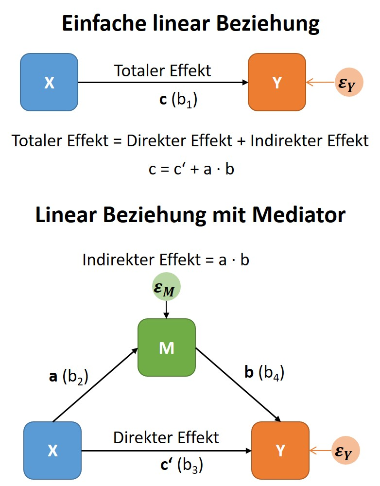
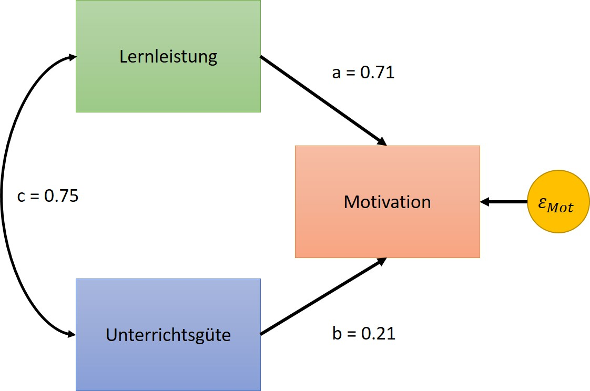
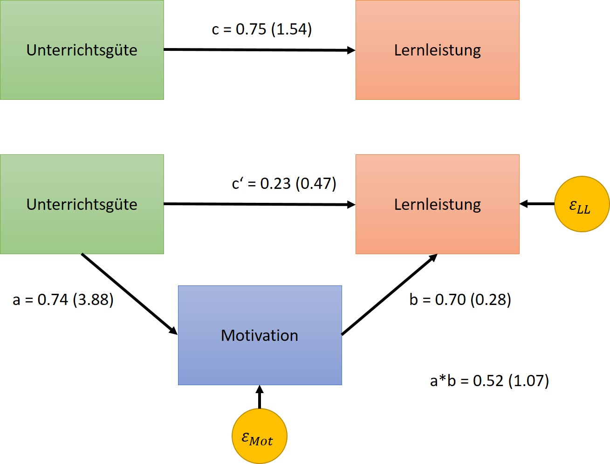
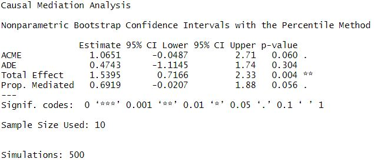

# (PART\*) Teil IV: Mediatior-Analyse {-}


```r
    # Field SPSS 5 - S497
    rm(list = ls())
    graphics.off()
    if (!require("pacman")) install.packages("pacman")
    pacman::p_load(pander, mediation, SciViews)
    
    # install.packages("sjPlot")
    # install.packages("yaml", dependencies = TRUE)
    # install.packages("sjPlot", dependencies = TRUE)
    # install.packages("sjmisc", dependencies = TRUE)
    # install.packages("stringi", dependencies = TRUE)
    # install.packages("httpuv", dependencies = TRUE)    
    # require(yaml)
    # require(sjPlot)
    # require(sjmisc)
    # 
    options(digits=3)
    # Verzeichnise InitialisierenCPS85
```

# Mediation {-}

Die Mediatior-Analyse kann als Spezialfall der multiplen linearen Regression (MLR) gesehen werden. Wie bei der MLR wollen wir den Zusammenhang mehrerer Variablen untersuchen, wobei in der Mediator-Analyse speziell der Einfluss eines Prädiktors (des Mediators, $M$) auf die Beziehung zwischen einem weiteren Prädiktor $X$ und dem Kriterium $Y$ im Zentrum des Interesses steht.

Bei der Mediation steht der Mediator $(M)$ sowohl in Beziehung zu $X$ als auch zu $Y$. Der **direkte Effekt** zwischen $X$ und $Y$ wird durch den **indirekten Effekt** über $M$ erklärt, also durch $X \rightarrow M \rightarrow Y$.

## Konzeptuelles Modell {-}

Eine Variable bezeichnet man als Mediatorvariable $M$, wenn sie die Beziehung zweier anderer Variablen ($X$ und $Y$) vermittelt/erklärt.

<center>

{ width=60% }

</center>

Dieser schematischen Darstellung kann man entnehmen, dass die Mediatorvariable dann einen Einfluss auf die Beziehung zwischen dem Prädiktor $X$ und dem Kriterium $Y$ hat, wenn sich  die Beziehung zwischen $X$ und $Y$ (im Diagramm Pfad $c$ - totaler Effekt) durch Berücksichtigung des Mediators $M$ ändert. Diese Änderung ist durch den direkten Effekt (im Diagramm Pfad $c'$) dargestellt. Die Stärke der Änderung und damit auch der Effekt des Mediators lässt sich darüber hinaus durch den indirekten Effekt ($a \cdot b$) beurteilen.

Um ein Mediatormodell zu prüfen, sind eine Reihe von Regressionsanalysen erforderlich:

1. Eine Regression mit $X$ als Prädiktor und $Y$ als Kriterium. Der daraus resultierende Regressionskoeffizient $b_1$ entspricht dem Pfad **c** im konzeptuellen Modell.

2. Eine Regression mit $X$ als Prädiktor und $M$ als Kriterium. Der daraus resultierende Regressionskoeffizient $b_2$ entspricht dem Pfad **a** im konzeptuellen Modell.

3. Eine Regression mit $X$ und $M$ als Prädiktoren und $Y$ als Kriterium. Der daraus resultierende Regressionskoeffizient $b_3$ des Prädiktors $X$ entspricht dem Pfad **c'** und der Koeffizient $b_4$ des Mediators $M$ entspricht dem Pfad **b** im konzeptuellen Modell.

Folgende Ergebnisse dieser Modelle würden für den Effekt des Mediators sprechen:

1. Die Regressionkoeffizienten $b_1, b_2$ und $b_3$ (also die Pfade **a**, **b**, **c** im Modell) zeigen ein signifikantes Ergebnis.
2. Der Regressionkoeffizient $b_3$ muss kleiner sein als $b_1$ ($c' < c$ im Modell)

Obwohl die Regressionsanalyse die grundlegende Idee der Mediationsanalyse gut zeigt, hat sie den Nachteil, dass der Effekt (Bedeutsamkeit) der Reduktion nicht wirklich klar ersichtlich ist. 

Häufig findet man noch folgende Kriterien (Baron and Kenny's Method) für die Entscheidung ob eine Mediation vorliegt:

>Eine Mediation liegt vor, wenn die Beziehung zwischen Prädiktor und Kriterium ohne Berücksichtigung des Mediators signifikant (p < .05) und mit Berücksichtigung des Mediators nicht mehr signifikant ist.

Diese Entscheidungsgrundlage entspricht dem NHST-Testen (all or nothing) und kann zu *maßgeblichen Fehlentscheidungen* führen, denn:

- Ein $b$-Wert kann sich unter Umständen nur um ein wenig ändern, der dazugehörige $p$-Wert kann sich dabei jedoch ohne weiteres von signifikant auf nicht signifikant ändern! 
- Bei einer großen Änderung des $b$-Wertes kann es aber auch durchaus vorkommen, dass beide signifikant bleiben! 

Als alternative Möglichkeiten zur Entscheidungsfindung haben sich folgende Verfahren bewährt:

- **Bootstrap Test**: berechnet Konfidenzintervalle für den indirekten Effekt. Liegt der Null-Effekt im CI, kann man davon ausgehen, dass keine Mediation vorliegt, anderenfalls hat man einen Mediator-Effekt gefunden. Diese Methode gibt über den Sobel-Test hinaus auch noch Auskunft über die Güte (Breite des CIs) des gefundenen Mediatior-Effektes. Wenn möglich, sollte diese Methode zur Absicherung des Effektes gewählt werden.
- **Sobel Test**: testet den indirekten Effekt (kombinierter Pfad **a** und **b**). Liefert dieser Test ein signifikantes Ergebnis, liegt eine signifikante Mediation vor. **Allerdings zeigt dieser Test folgende Problembereiche**:
    + Die Annahme, dass $a \cdot b$ eine normalverteilte Stichprobenverteilung besitzt, ist vor allem bei kleinen Stichproben zweifelhaft.
    + Der Test besitzt eine schlecht Power womit große Konfidenzintervall einhergehen. Die Präzision des Tests ist damit in Frage zu stellen!

## Effektgrößen der Mediation {-}

Die einfachste Effektgröße ist der Regressionskoeffizient für den indirekten Effekt und das dazugehörige CI. Der indirekte Effekt ergibt sich aus den kombinierten Effekten der Pfade **a** und **b**, also:

Unstandardisierter indirekter Effekt: $UIE = a \cdot b$

Um einerseits den Effekt mit anderen Mediationsmodellen vergleichen zu können, und andererseits einen Kennwert zu berichten, der vor allem in einer Meta-Analyse verwendet werden kann, standardisiert man den indirekten Effekt (**index of mediation**):

Standardisierter indirekter Effekt: $SIE = a \cdot b \cdot \frac{s_{X_i}}{s_{Y}}$

## Fallbeispiel {-}

Wir betrachten zunächst folgende Hypothese:

> Die Motivation zu lernen ist einerseits durch die Güte des Unterrichtes und andererseits durch die Erfolge aufgrund der Lernleistung beeinflusst. Man möchte nun herausfinden, welcher der beiden Prädiktoren eine bessere Vorhersage liefert. Dazu wurden in einer Lehr-Lernstudie mit Einzeltutoren von $N = 10$ StudentInnen Daten zur *Motivation*, *Lernleistung* und *Unterrichtsgüte* erfasst.

<center>


----------------------------------------------
 Motivation   Lernleistung   Unterrichtsguete 
------------ -------------- ------------------
     98            4                5         

     98            5               6.5        

    103            6                7         

    101            7               5.5        

    100            8                9         

    106            10              6.5        

    111            11               8         

    125            12              10.5       

    120            14               8         

    115            15               10        
----------------------------------------------

</center>

### Regressionsanalyse {-}

Wenn wir von der Hypothese ausgehen, dass die *Motivation* zu lernen durch die *Güte des Unterrichts* sowie der *Lernleistung* beeinflusst wird, ist es zunächst von Interesse festzustellen, ob dieses Merkmale überhaupt in Beziehung zueinander stehen. In folgenden rechnen wir daher zuerst die Korrelationen zwischen den Merkmalen. Kopier den Code in ein R-Script und führe diesen aus. Diskutiere die Ergbnisse!


```r
    # library(SciViews) # für Funktion correlation
    KorTab <- SciViews::correlation(DF)
    pander(KorTab, digits = 3)
```


---------------------------------------------------------------------
        &nbsp;          Motivation   Lernleistung   Unterrichtsguete 
---------------------- ------------ -------------- ------------------
    **Motivation**          1           0.867            0.741       

   **Lernleistung**       0.867           1              0.746       

 **Unterrichtsguete**     0.741         0.746              1         
---------------------------------------------------------------------

```r
    plot(KorTab, type = "lower", digits = 3)
```


Wenn wir nun die Merkmale *Lernleistung* und *Unterrichtsgüte* als Regressoren und *Motivation* als Regressand verwenden, können wir folgendes Modell aufstellen:

<center>

$Motivation = b_0 + b_1 \cdot Lernleistung + b_2 \cdot Unterrichtsguete$

</center>

Kopiere den nachfolgenden Code in dein R-Script und führe diesen aus. Diskutiere die Ergebnisse und vergleiche diese mit nachfolgendem statistischen Pfadmodell.


```r
    Mod1     <- lm(Motivation ~ Lernleistung + Unterrichtsguete, data = DF)
    Mod1_Std <- lm(scale(Motivation) ~ scale(Lernleistung) + 
                     scale(Unterrichtsguete), 
                   data = DF)
    
    # pander(summary(Mod1), digits = 3)
    pander(summary(Mod1_Std), digits = 3)
```


----------------------------------------------------------------------------
           &nbsp;              Estimate   Std. Error    t value    Pr(>|t|) 
----------------------------- ---------- ------------ ----------- ----------
       **(Intercept)**         -3.4e-16     0.172      -1.98e-15      1     

   **scale(Lernleistung)**      0.708       0.271        2.61       0.0349  

 **scale(Unterrichtsguete)**    0.213       0.271        0.784      0.459   
----------------------------------------------------------------------------


--------------------------------------------------------------
 Observations   Residual Std. Error   $R^2$    Adjusted $R^2$ 
-------------- --------------------- -------- ----------------
      10              0.5424          0.7712       0.7058     
--------------------------------------------------------------

Table: Fitting linear model: scale(Motivation) ~ scale(Lernleistung) + scale(Unterrichtsguete)

Die dargestellten Ergebnisse zeigen die standardisierten Koeffizienten ($\beta_{LL}, \beta_{UG}$). In einem statistischen Pfadmodell lassen sich die bisher gewonnenen Ergebnisse folgendermaßen zusammenfassen:


<center>

{ width=60% }

</center>

Dem Ergebnis ist weiters zu entnehmen, dass beide Prädiktoren das Ausmaß der Motivation vorhersagen, wobei die Lernleistung ($a = \beta_{LL} = 0.708$ und somit $R_{LL}^2 = 0.504$) sich als der bessere Prädiktor als die Unterrichtsgüte ($b = \beta_{UG} = 0.213$ und somit $R_{UG}^2 = 0.044$) herausstellt.

### Mediator-Analyse {-}

Man könnte allerdings auch von folgender Hypothese ausgehen:

> Je höher die *Unterrichtsgüte*, desto höher die *Motivation* und je höher die *Motivation* der Studenten, desto höher wird die *Lernleistung* ausfallen. Die Modellvorstellung wäre demnach *Unterrichtsgüte* $\rightarrow$ *Motivation* $\rightarrow$ *Lernleistung*. Die *Motivation* wäre dann nicht ein Effekt der *Lernleistung*, was bedeutet dass die Kausalwirkung umgekehrt verläuft.

In diesem Fall würde die *Unterrichtsgüte* indirekt über die Mediatorvariable *Motivation* auf die *Lernleistung* wirken. Darüber hinaus ist auch anzunehmen, dass die *Unterrichtsgüte* auch eine direkte Wirkung auf die *Lernleistung* ausübt. Diese Modellvorstellung lässt sich im folgenden Pfadmodell abbilden:

<center>

{ width=60% }

</center>

Diese Modellvorstellung kann man in folgenden Regressionsberechnungen zerlegen:

1. In der ersten Regression wird die abhängige Variable (Output, Kriterium) *Lernleistung* durch die unabhängige Variable (Prädiktor) *Unterrichtsgüte* vorhergesagt. Im vorliegenden Beispiel bezeichnen wir den Steigungskoeffizienten mit $b_1$. Dieser entspricht im konzeptuellen Modell dem Pfad **c**. Formal entspricht das Modell:

<center>

$Lernleistung = b_0 + b_1 \cdot Unterrichtsguete$

</center>

Kopiere den nachfolgenden Code in dein R-Script und führe diesen aus. Diskutiere die Ergebnisse und vergleiche diese mit obigen Pfadmodell.


```r
    Med_Mod_C     <- lm(Lernleistung ~ Unterrichtsguete, data = DF)
    Med_Mod_C_Std <- lm(scale(Lernleistung) ~ scale(Unterrichtsguete), data = DF)
    
    # pander(summary(Med_Mod_C), digits = 3)
    pander(summary(Med_Mod_C_Std), digits = 3)
```


--------------------------------------------------------------------------
           &nbsp;              Estimate   Std. Error   t value   Pr(>|t|) 
----------------------------- ---------- ------------ --------- ----------
       **(Intercept)**         3.57e-17     0.224      1.6e-16      1     

 **scale(Unterrichtsguete)**    0.746       0.236       3.16      0.0133  
--------------------------------------------------------------------------


--------------------------------------------------------------
 Observations   Residual Std. Error   $R^2$    Adjusted $R^2$ 
-------------- --------------------- -------- ----------------
      10              0.7068          0.5559       0.5004     
--------------------------------------------------------------

Table: Fitting linear model: scale(Lernleistung) ~ scale(Unterrichtsguete)

2. In der zweiten Regression betrachten wir den Pfad *Unterrichtsgüte* zu *Motivation* (im konzeptuellen Modell der Pfad **a**), alsoe: 

<center>

$Motiviation = b_0 + b_1 \cdot Unterrichtsguete  + \varepsilon_{Mot}$

</center>

Kopiere den nachfolgenden Code in dein R-Script und führe diesen aus. Diskutiere die Ergebnisse und vergleiche diese mit obigen Pfadmodell.


```r
    Med_Mod_A     <- lm(Motivation ~ Unterrichtsguete, data = DF)
    Med_Mod_A_Std <- lm(scale(Motivation) ~ scale(Unterrichtsguete), data = DF)
    
    # pander(summary(Med_Mod_A), digits = 3)
    pander(summary(Med_Mod_A_Std), digits = 3)
```


----------------------------------------------------------------------------
           &nbsp;              Estimate    Std. Error   t value    Pr(>|t|) 
----------------------------- ----------- ------------ ---------- ----------
       **(Intercept)**         -3.15e-16     0.225      -1.4e-15      1     

 **scale(Unterrichtsguete)**     0.741       0.238        3.12      0.0143  
----------------------------------------------------------------------------


--------------------------------------------------------------
 Observations   Residual Std. Error   $R^2$    Adjusted $R^2$ 
-------------- --------------------- -------- ----------------
      10              0.7126          0.5486       0.4922     
--------------------------------------------------------------

Table: Fitting linear model: scale(Motivation) ~ scale(Unterrichtsguete)

3. In der dritten Regression wird nun die Beziehung *Unterrichtsgüte* und *Lernleistung*, wie auch *Motivation* und Lernleistung (im konzeptuellen Modell der Pfad **b** und **c'**) überprüft. Das formale Modell lautet also:

<center>

$Lernleistung = b_0 + b_1 \cdot Unterrichtsguete + b_2 \cdot Motivation + \varepsilon_{LL}$

</center>

Kopiere den nachfolgenden Code in dein R-Script und führe diesen aus. Diskutiere die Ergebnisse und vergleiche diese mit obigen Pfadmodell.


```r
    Med_Mod_CS_B     <- lm(Lernleistung ~ Unterrichtsguete + Motivation, data = DF)
    Med_Mod_CS_B_Std <- lm(scale(Lernleistung) ~ scale(Unterrichtsguete) + 
                                                 scale(Motivation), 
                                                 data = DF)
    
    # pander(summary(Med_Mod_CS_B), digits = 3)
    pander(summary(Med_Mod_CS_B_Std), digits = 3)
```


--------------------------------------------------------------------------
           &nbsp;              Estimate   Std. Error   t value   Pr(>|t|) 
----------------------------- ---------- ------------ --------- ----------
       **(Intercept)**         2.55e-16      0.17      1.5e-15      1     

 **scale(Unterrichtsguete)**     0.23       0.267       0.861     0.418   

    **scale(Motivation)**       0.696       0.267       2.61      0.0349  
--------------------------------------------------------------------------


--------------------------------------------------------------
 Observations   Residual Std. Error   $R^2$    Adjusted $R^2$ 
-------------- --------------------- -------- ----------------
      10               0.538          0.7749       0.7106     
--------------------------------------------------------------

Table: Fitting linear model: scale(Lernleistung) ~ scale(Unterrichtsguete) + scale(Motivation)

Die bis zu diesem Punkt durchgeführten Analysen lassen uns zwar den Effekt des Mediators erkennen, aber die Abschätzung, ob dieser auch statistisch signifikant ist. Im letzten Schritt unserer Analyse verwenden wir das R-Paket *mediation*. Kopiere nachfolgenden Code in dein Skript und führe die Zeilen aus.


```r
    # library(mediation)
    model.0 <- lm(Lernleistung ~ Unterrichtsguete, DF)
    model.M <- lm(Motivation   ~ Unterrichtsguete, DF)
    model.Y <- lm(Lernleistung ~ Unterrichtsguete + Motivation, DF)
    med.out <- mediation::mediate(model.M, model.Y, treat='Unterrichtsguete', mediator='Motivation',
                                  boot=TRUE, sims=500)
    
    # summary(model.0)
    # summary(model.M)
    # summary(model.Y)
    # summary.mediate(med.out)
```


<center>

{ width=80% }

</center>

1. Der angegebene totale Effekt ($c = b_1 = 1.5395$) entspricht dem Effekt von Unterrichtsgüte auf die Lernleistung (ohne Berücksichtigung des Mediators!).
2. Der direkte Effekt (ADE, $c' = b_4 = 0.4743$) spiegelt den Effelt von Unterrichtsgüte auf Lernleistung unter Berücksichtigung der Motivation wider.
3. Der Mediator-Effekt (ACME) entspricht der Differenz des totalen und direkten Effektes (also $c - c' = b_1 - b_4 = 1.5395 - 0.4743 = 1.0651$). Das entspricht natürlich auch dem Produkt von $a \cdot b = b_2 \cdot b_3 = 3.88 \cdot 0.275 = 1.0651$.

Wird dieser Effekt statistisch signigikant, nimmt man die Hypothese der Wirksamkeit des Mediators an.
