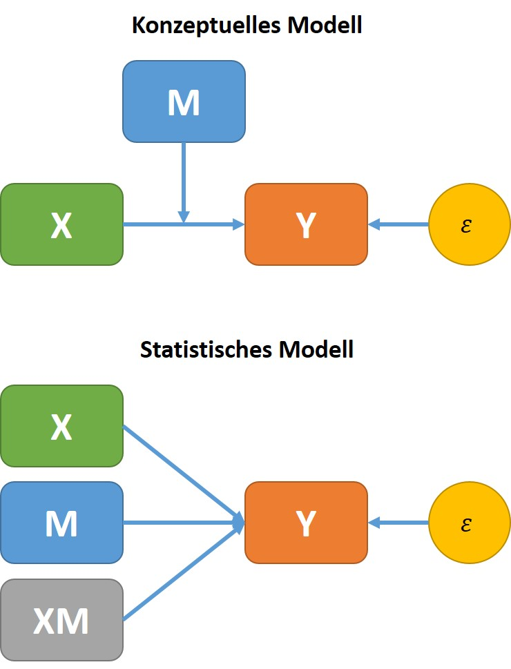

# (PART\*) Teil V: Moderator-Analyse {-}


```r
    # Field SPSS 5 - S481
    
    rm(list = ls())
    graphics.off()
    if (!require("pacman")) install.packages("pacman")
    pacman::p_load(DT, ggplot2, interactions, pander)
    options(digits=3)
    # Verzeichnise InitialisierenCPS85
```

# Moderation {-}

Fördert das Spielen von gewalttätigen Videos unsoziales, bzw. aggressives Verhalten?

In einer Studie wurde der Zusammenhang zwischen dem Spielen von aggressiven Videos wie z.B. Manhunt, Grand Theft Auto und MadWorld mit Aggression untersucht. Dabei wurden $N = 442$ Jugendliche bezüglich ihres aggressiven Verhaltens (*Aggression*), den gefühls- und emotionslosen Charaktereigenschaften (Callous Unemotional Traits - CUT, *CaUnTs*) und der Dauer des Videospielen in Stunden pro Woche (*VidGames*) aufgezeichnet. Die Daten finden Sie unter *Video Games.csv*.

<center>


---------------------------------------------------
 ID   Aggression   Vid_Games   CaUnTs   CaUnTs_Grp 
---- ------------ ----------- -------- ------------
 1        27          20         7         Low     

 2        30          34         14        Low     

 3        37          20         8         Low     

 4        29          29         13        Low     

 5        22          22         15        Low     

 6        29          34         7         Low     
---------------------------------------------------

</center>

Das Ziel der Untersuchung ist es, die Beziehung zwischen Spieldauer (= Prädiktor, *Vid\_Games*) und Aggression (*Aggression*) genauer zu untersuchen.

# Konzeptuelles Modell {-}

Eine Moderatorvariable ist eine Variable, welche die Beziehung zweier anderer Variablen beeinflusst.

<center>

{ width=50% }

</center>

Im Prinzip stellt sich also die Frage, ob eine Variable ($X_1$) einen Interaktionseffekt auf die Beziehung der beiden anderen Variablen ($Y, X_2$) bewirkt. Ein derartiger Interaktionseffekt ist im statistischen Sinne gleichzusetzen mit einem Moderationseffekt (konzeptueller Begriff).

Betrachtet man die Beziehung zwischen der abhängigen Variablen (*Aggression*) und der erklärenden Variablen (*Vid\_Games*):


```r
    p <- ggplot(DF, aes(x = Vid_Games, y = Aggression)) + 
        geom_point() + 
        geom_smooth(method = lm, se = FALSE) +
        theme_bw()
    print(p, comment = FALSE)
```


```r
    SumMod1 <- summary(lm(Aggression ~ Vid_Games, data = DF))
    pander(SumMod1)
```


---------------------------------------------------------------
     &nbsp;        Estimate   Std. Error   t value   Pr(>|t|)  
----------------- ---------- ------------ --------- -----------
 **(Intercept)**    34.84        1.96       17.77    1.166e-53 

  **Vid_Games**     0.2385     0.08552      2.789    0.005515  
---------------------------------------------------------------


---------------------------------------------------------------
 Observations   Residual Std. Error    $R^2$    Adjusted $R^2$ 
-------------- --------------------- --------- ----------------
     442               12.5           0.01737      0.01514     
---------------------------------------------------------------

Table: Fitting linear model: Aggression ~ Vid_Games

scheint die Spieldauer und Aggression nur in einem geringen Ausmaß miteinander in Beziehung zu stehen. Die aufgeklärte Varianz beträgt gerade einmal ``1.737``\%.

Ein anderes Bild ergibt sich jedoch, wenn man die Daten unter Berücksichtigung der Variablen *CaUnTs* betrachtet. Teilt man die Variable *CaUnTs* z.B. durch einen Mediansplit in zwei Gruppen (*CaUnTs\_Grp* = Low und High), zeigt sich bereits ein sehr unterschiedliches Bild:


```r
    p1 <- ggplot(DF, aes(x = Vid_Games, y = Aggression, color = CaUnTs_Grp)) + 
        geom_point() + 
        geom_smooth(method = lm, se = FALSE) +
        theme_bw()
    print(p1, comment = FALSE)
```


Durch die Trennung können folgende Eigenschaften in den Daten beobachtet werden:

- Bei Personen die keine CUT aufweisen, besteht keine Beziehung der Spieldauer und der Aggression.
- Personen die einen CUT aufweisen, zeigen eine positive Beziehung, d.h. je mehr Zeit sie spielen, desto
höher wird ihr Aggressionslevel.
- Die CUT beeinflusst (moderiert) daher die Beziehung der Spieldauer und Aggression.

Den Effekt der Variablen *CaUnTs* (Moderatorvariablen) kann man sich gut durch folgende Darstellung vorstellen:


```r
    Mod_1 <- lm(Aggression ~ Vid_Games * CaUnTs, data=DF)
    # plotPlane(model = Mod_1, plotx1 = "Vid_Games", plotx2 = "CaUnTs")
```

<center>

{ width=50% }

</center>

Dass die Moderatorvariable einen Einfluss auf die Beziehung zwischen *Vid\_Games* und *Aggression* hat, zeigt sich vor allem dadurch dass bei niedrigen *CaUnTs*-Werten eine negative und bei hohen *CaUnTs*-Werten eine positive Beziehung zwischen Spieldauer und Aggression besteht. Damit wird auch der Kernpunkt eines Moderationseffektes angesprochen. Ein Moderationseffekt liegt vor, wenn sich die Beziehung zweier Variablen vom Wertebereich des Moderator abhängig ist.

## Formale Beschreibung des Modells {-}

Das lineare Modell einer Moderationsanalyse erweitert die bereits bekannte multiple Regression um den Interaktionsterm:

<center>

$\widehat{Aggression}_i = (b_0 + b_1 \cdot Spieldauer_i + b_2 \cdot Callous_i + b_3 \cdot Interaktion_i)$

</center>

In den meisten Statistikprogrammen (R, SPSS, SAS, etc.) gibt es Pakete/Makros, mit denen die Moderationsanalyse (u.v.m) speziell aufbereitet wird. Im vorliegenden Fall sollte anhand des einfachen Modells die grundlegende Idee vorgestellte werden. 

Bei der obigen Formel sind bis auf die Interaktion alle Daten bereits im geladenen Datenmaterial verfügbar. Die Interaktion kann nun sehr leicht aus diesen Daten berechnet und als weitere Variable im Datenframe abgespeichert werden. Dazu braucht man nur die beiden Variablen *Vid\_Games* und *CaUnTs* multiplizieren und speichern.


```r
    DF$IA <- DF$Vid_Games*DF$CaUnTs
```

Im nachfolgenden Ergebnis ist vor allem der Interaktionseffekt von Interesse. Ist die Interaktion signifikant, kann man davon ausgehen, dass ein bedeutsamer Moderationseffekt vorliegt.


```r
    pander(summary(Mod_1))
```


--------------------------------------------------------------------
        &nbsp;          Estimate   Std. Error   t value   Pr(>|t|)  
---------------------- ---------- ------------ --------- -----------
   **(Intercept)**       33.12       3.427       9.664    3.729e-20 

    **Vid_Games**       -0.3336      0.1508     -2.212     0.0275   

      **CaUnTs**         0.1689      0.161       1.049     0.2947   

 **Vid_Games:CaUnTs**   0.02706     0.006981     3.877    0.0001221 
--------------------------------------------------------------------


--------------------------------------------------------------
 Observations   Residual Std. Error   $R^2$    Adjusted $R^2$ 
-------------- --------------------- -------- ----------------
     442               9.976          0.3773       0.373      
--------------------------------------------------------------

Table: Fitting linear model: Aggression ~ Vid_Games * CaUnTs

Bei vorliegender signifikanter Interaktion kann durch eine **Simple Slope Analyse** (SSA) die Beziehung zwischen Prädiktor und Kriterium für verschiedene Werte des Moderators untersucht werden. 

Häufig werden dafür drei Werte des Moderators (niedrig = $\bar{x}_{Mod} - sd_{Mod}$, mittel = $\bar{x}_{Mod}$, hoch = $\bar{x}_{Mod} + sd_{Mod}$) verwendet. In der folgenden Abbildung wurden die Datenpunkte noch zusätzlich nach Ihrer Ausprägung (Größe) bei *CaUnTs* gewichtet.


```r
    # library(interactions)
    # # https://cran.r-project.org/web/packages/jtools/vignettes/interactions.html
    interact_plot(Mod_1,
                  pred = "Vid_Games",
                  modx = "CaUnTs",
                  plot.points = TRUE)
```


Für eine feiner Aufteilung, bzw. Darstellung des Wirkungsbereiches vom Moderator kann über die Johnson und Neymann Methode sehr viele Werte des Moderators berechnen werden. Die entsprechenden $b$'s werden ermittelt und daraus Signifikanz-Zonen berechnet. Damit werden die Werte des Moderators ermittelt, ab welchen der Prädiktor ein signifikantes Ergebnis liefert.


```r
    Mod_SS <- lm(Aggression ~ Vid_Games + CaUnTs + (Vid_Games * CaUnTs), data=DF)
    SS_Res <- sim_slopes(Mod_SS, pred = Vid_Games, modx = CaUnTs, johnson_neyman = TRUE)    
    johnson_neyman(Mod_SS, pred = Vid_Games, modx = CaUnTs, alpha = 0.01)
```

JOHNSON-NEYMAN INTERVAL 

When CaUnTs is OUTSIDE the interval [-5.35, 18.86], the slope of
Vid_Games is p < .01.

Note: The range of observed values of CaUnTs is [0.00, 43.00]


## Zentrierung der Variablen {-}

Durch die Berücksichtigung der Interaktion, bekommen die Koeffizienten eine spezielle Bedeutung.

Ein Prädiktor $X_i$ repräsentiert die Regression des Kriteriums, wenn die anderen Prädiktoren $X_{j \ne i}$ gleich Null sind!

Im Beispiel:

- $b_1$ entspricht dem Koeffizienten einer Regression wenn CaUnTs gleich Null ist, also keine Gefühls und emotionslosen Charaktereigenschaften aufweist.
- $b_2$ entspricht dem Koeffizienten einer Regression wenn VidGames gleich Null ist, also 0 Stunden Video gespielt hat.

Im gegebenen Beispiel sind für beide Prädiktoren Null-Werte durchaus möglich. Würde man aber anstelle der Charaktereigenschaften die Herz-Rate der Jugendlichen messen, wäre ein Wert von Null nicht sinnvoll.

Aus diesem Grund werden in einer Moderationsanalyse die Prädiktoren transformiert. Man zentriert die Daten auf die Abweichungen des *grand averages*.

### Eigenschaften der Zentrierung {-}

Das Zentrieren der Prädiktoren ist ähnlich der bekannten z-Transformation, wobei bei der Zentrierung die Division durch die Standardabweichung nicht relevant ist.

Formal entsprechen die zentrierten Daten also:

$X^C_{1i} = X_{1i} - \bar{X}_{11}$

Die Zentrierung hat keinen Einfluss auf den Koeffizienten, welcher die meisten Variablen (highest-order-predictor) verknüpft. Im gegebenen Beispiel entspricht das dem Koeffizienten $b_3$, also der Interaktion. Für die Koeffizienten $b_1$ und $b_2$ bewirkt die Zentrierung:

- $b_2$ zeigt den Effekt zwischen Agression und CUT, wenn jemand die durchschnittliche Spielzeit mit Videospielen verbringt.
- $b_1$ zeigt den Effekt zwischen Agression und Spieldauer, wenn jemand den durchschnittlichen CUT-Wert haben würde.

### Gründe für Zentrierung {-}

Aus Gründen der Interpretierbarkeit, z.B. $y$ = verbale Fähigkeiten eines Kindes, $x_1$ = Vokabular von der Mutter, $x_2$ = Alter des Kindes:

- $b_0$ ist nicht sinnvoll interpretierbar, wenn $x_1 = 0$ und $x_2 = 0$
- $b_0$ ist aber dann sinnvoll interpretierbar, wenn die Variablen zentriert wurden, denn dann sind die Werte 0 für beide Variablen eben der Mittelwert der zentrierten Variablen!
- $b_1$ entspricht der Steigung von $x_1$ unter der Annahme eines durchschnittlichen Wertes von $x_2$. Liegt keine Moderation vor, wir $b_1$ konsistent über alle Werte der $x_2$-Verteilung sein.
- Liegt ein Moderationseffekt vor, ist $b_1$ nicht konsistent über die Verteilung der $x_2$-Werte.

Aus statistischen Gründen:

- korrelieren $x_1$ und $x_2$ dann kann es sein, dass auch die Interaktion $x_1 \cdot x_2$ hoch korreliert! Wenn zwei Prädiktoren in einem GLM hoch miteinander korrelieren, dann sind sie im wesentlichen redundant. Es liegt eine hohe Multikollinearität vor! Es wird auch schwierig, die $b$-Werte den jeweiligen Prädiktoren zuzuordnen.
- Bei Zentrierung der Daten kann dieses Problem entschärft werden.

### Interpretation der $b$'s {-}

Die Zentrierung ermöglicht die Interpretation der Koeffizienten $b_1$ und $b_2$ (lower-order-predictors) auch dann, wenn Null-Werte bei Prädiktoren nicht sinnvoll zu interpretieren sind!

Die Interpretation von lower-order-predictors ist nur sinnvoll, wenn die higher-order-predictors nicht signifikant sind!

Bei zentrierten Prädiktoren können die $b$'s von einzelnen Prädiktoren folgendermaßen interpretiert werden:

1. sie zeigen den Effekt des jeweiligen Prädiktors beim Mittelwert der Stichprobe.
2. sie zeigen den durchschnittlichen Effekt des Prädiktors über die Spannweite der Werte des anderen Prädiktors.

Bemerkung zu 2: stellen Sie sich vor, dass Sie für jeden möglichen Wert der Spieldauer (VidGames = von 0 bis max(Spieldauer)) jeweils ein lineares Modell rechnen, also ein Modell zur Vorhersage für Aggression durch CUT für die Personen die 0 Std. gespielt haben. Dann dasselbe Modell für jene die 1 Std. gespielt haben, etc.

Dadurch ergeben sich z.B. $N$ unterschiedliche $b$'s, wobei jedes davon den Zusammenhang zwischen CUT und Aggression für unterschiedlich lange Spieldauer zeigt. Würde man den Mittelwert dieser $b$'s berechnen,  dann wäre dieser Wert gleich dem $b$-Wert für CUT (zentriert) wenn dieser im Moderationsmodell gemeinsam mit der zentrierten Spieldauer (VidGames) und der Interaktion berechnet wird!

### Interaktion {-}

Besteht eine signifikante Interaktion zwischen den beiden Prädiktoren, liegt ein Moderationseffekt vor!

Ist die Interaktion $CaUnTs \times Vid\_Games$ ein signifikanter Prädiktor für Agression, dann wissen wir zwar dass ein Moderationseffekt vorliegt, aber nicht in welcher Weise! Es könnten folgende Zusammenhänge bestehen:

- Es könnte sein, dass die Spieldauer immer einen negativen Einfluss auf den Aggressions hat, aber diese Beziehung bei höher werdenden CUT noch wesentlich verstärkt wird.
- Es könnte sein, dass bei Personen mit niedrigem CUT die Spielzeit die Agression verringert, aber bei Personen mit hohen CUT die Aggression verstärkt.

Die Simple Slope Analysis (SSA) bietet bei der Interpretation der Interaktionseffekte eine wesentliche Hilfestellung.
